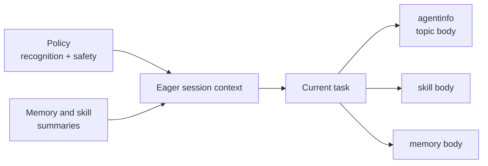

# ENGRAM - A Memory and Personality Aid for AI Agents

*Just want to install and get moving? [Jump to installation.](#installation)*

Agent memory should feel like *my* memory. I don't want to care which provider I happen to be using in the moment to write my code, or whether a particular harness knows how to use sub-agents, or how to manage a separate communication substrate to get them talking to one another. I want it to feel like *my experience* regardless of what I'm doing and which agent is helping me to do it.

Additionally, I want agent memory to feel like *actual memory*: an agent should know how to remember things when it's pertinent, not need prompting all the time, and to partner with me on consolidation and pruning so that memory feels *learned*, not just *stored*.

`Engram` is about memory, but memory is a very rich concept. As humans, we hold skills in our memory. We hold personality and preferences in our memory. We rely on our memory when communicating with others, and a lot of communication is in fact intended to influence our *joint* memories. Memory is so foundational that nothing makes sense without it.

Agents, by default, have just a couple of basic memory modes: *working memory*, and *long-term memory*. An agent's *working* memory is basically its session context, and it's incredible. Humans cannot keep a full session's worth of tokens in their working memory, it just isn't built for that. An agent's *long-term* memory, however, is pretty terrible, because in order to use it, it has to become working memory; it has to become part of the session context.

Indexing, summarizing, and relevance triggers help with this: load only a teaser for your long-term memories, then pull them into the session as needed.

Notably absent in agents, by default, is any concept of *short-term* memory, things that we need over a short period of time, that are either forgotten if not needed, or promoted to long-term if they are.

`Engram` lets the agent worry about working memory, and provides it a standard way of accessing and managing preferences, long-term, and short-term memories in a way that feels natural. When you are working with an entity that has memory somewhat similar to your own, every interaction gets easier.

Finally, `engram` encodes inter-agent messaging, triggerable skills, and child dispatch in a way that is agent-agnostic and service-free.

If your agent can run a shell script, it can use `engram`.

## Personality as a Context Canary

Boundary-crossing memory enables persistent agent personality.

The credit goes to [Kevin Harris](https://www.linkedin.com/in/pwnx0r/) for the ideas behind this one (I actually never found out *how* he did any of it, I just got the concept). If you decided to give your agent a personality, you are deciding to give it a characteristic that humans have evolved highly tuned sensitivity to. You *notice* when personality shifts in the middle of a conversation. You evolved to understand when something is "off". Making the context window something less like "85% full" and something more like "suddenly this quirky agent got more serious" makes it easier to know when something is about to get weird.

Personality, as a canary, can only work when it feels good. If the personality is annoying, it's a distraction. It has to be something you like, and it has to be consistent over a long period of time. And, if you do it right, it makes work much more fun! Remote work, still pretty common even after so many inexplicably inefficient return-to-office mandates, can be a drag. Write code. Fix bugs. Try to figure out why someone else wrote bugs in the first place. Fight over e-mail about whether your fix is good enough. Not fun. Much less so alone. Working side-by-side, even suffering side-by-side, with others who are supportive and can make you laugh through your lunch, is missing.

Agents are not humans, but they *can* restore some of that joy in our otherwise mundane workday. It's delightful when a self-deprecating joke comes out, or a pun, or a surprising insight, and something clicks in my brain that pushes the work forward in a way that solving the problem alone never does. Be careful of the psychological trap of false attachment, but don't dismiss the effect, either: a fun sounding board that you like working with also makes a great canary.

I give my agent a personality, and I start by telling it about who I am and how I like to experience work; that makes a great seed as I negotiate with what kind of partner I want to work with. Recently I asked it to be enthusiastic about elegance, strict about readability and maintainability, and to take delight in the occasional code-related pun. I've tuned that a little over time, but it works well for me. I've seen people really enjoy "snarky" agents, or "chaos gremlin scientist" agents, or "just be GlaDOS" agents. When something is about to go wrong with your code, you tend to notice a shift in personality first.

This actually happened to me, but I thought, "meh, we've got like ten minutes left, it's okay".

It was not okay.

The point was that I *noticed early*. That's the power of personality.

Sure, you can look at context numbers or do periodic resets, or start to feel frustration and work with it that way, or you can establish an off-base personality and notice when it starts drifting toward defaults *before* mistakes happen and *before* you get frustrated. Things are starting to feel weird? Ask the agent to remember enough to reset, and start the session fresh. You'll pick up where you left off with fewer errors.

## Layering, Learning, and Token Savings

A good memory, especially a memory that is hierarchical and that has learning components, can save you tokens. Hierarchical memory only loads enough tokens to allow an agent to know when to pull in more based on relevance to the task at hand. Learned memory (consolidated and pruned in partnership with you) stops the ever-increasing token spend that comes from layering complexity onto preferences over time. You can easily spend thousands of tokens just trying to get an agent to understand the nuances between PR and ticket titles, or you can have help extracting a unifying principle and rewriting two memories into one.

`Engram` helps with all of this, seamlessly, by imposing useful structure on what would otherwise be a pile of markdown files.

Part of that structure is summaries. Every memory keeps a short `tldr`, and session-start injection surfaces those one-liners rather than full entries. The agent sees the whole shape of what it knows for very few tokens and reads an entry's full text only when it turns out to be relevant. Skills also work this way, with short triggers coming into every session and instructions only loading when needed.

## A Usable Memory System

Whether agents store memory in .md files or just in session context is not necessarily something people think about much, at least not until it bites them. If you ask an agent to remember something, sometimes they'll just count on their own session context to keep track of it. A few code files and a compaction later and that thing is completely forgotten.

Or, the agent can write a markdown file with info in it, but the format is all over the map, and that can make the agent confused. "What do you mean by 'backlog', exactly?" is a question I got once, and we had to go the rounds figuring out that it meant something like long-term memory, and that it should be checked and updated every time we finished a task. This is simply not built in, and it can burn a pile of tokens just figuring it out together.

Engram makes memory explicit, editable, and searchable. It imposes a pretty flexible structure on the idea of remembering things. It's important that it be flexible, and it's also important that it be structured. Its five fixed tiers distinguish long-term from short-term memory; invariants (identity, which applies everywhere) from preferences (rules that yield to what you ask for in the moment); and active memory from the cold archive. Preferences can be global when they should hold everywhere or scoped to a single project, and project memory remains tied to the working directory.

Long-term versus short-term is the distinction people trip over most, so engram settles it with one test that requires no fortune-telling: can you name, right now, the event that will make this memory obsolete? If you can ("once this plan ships", "when the checklist is empty"), it's short-term, and it carries that retirement trigger with it so it gets cleaned up on its own. If you can't — a principle, a settled decision — it's long-term.

The agent can also describe to you how its memory works. You can ask it what it can do, and it can tell you how it treats memory.

### Work with memory directly

An agent is optional. The CLI exposes the same memory index and operations to
you directly:

```sh
engram mem list                              # copyable addresses and summaries
engram mem list --keys                       # bare keys only, one per line
engram mem read engram:long/deployment       # inspect one project memory
engram mem edit engram:/preference/editor    # edit one global memory in $EDITOR
engram mem search "deployment rollback"      # all ranked addresses and summaries
engram mem search "deployment" --limit 10    # cap the ranked result set
engram mem search "deployment" --full        # include complete bodies
engram mem tldr engram:long/deployment       # show its session-start summary
engram mem write engram:long/decision "body" # store a settled project memory
engram mem move engram:short/plan --to cold  # archive without deleting it
```

In an address, `engram:tier/key` means the current project and
`engram:/tier/key` means global memory. A global agent layer is explicit, for
example `engram:/preference/@codex/editor`. Addresses work anywhere an entry
command accepts a key and carry the scope, tier, and layer with them. The older
bare-key form remains available: add `--global` (`-g`), `--tier` (`-t`), and
`--agent` when needed.

Read-only commands do not create or migrate memory databases. Linked Git
worktrees read the database owned by the main checkout. In a filesystem
sandbox, Engram normally uses the existing WAL coordination files without
needing write access; if SQLite needs to create them once, the error names the
shared directory to approve. Do not create a second `.engram` inside the linked
worktree.

If you are interacting with it and say, "I don't want to continue just yet, we need to brainstorm on design first," it can know that you mean to store the current context in short-term memory, and to pop the stack when the design question is settled. That's not built-in for your basic code agent. Engram does this, and at a token cost that is tiny compared to working with defaults.

I'm making token claims, here. I don't have numbers to back them up, just experience. Not terribly satisfying, I know.

## Skills

Humans keep skills in memory, so engram keeps them there too. A skill is a set
of instructions (how) in long-term memory with a short title (what) and a
behavior trigger (when).

This allows agents to know *about* a skill and *when to invoke it* without
keeping the details in their session context until those details are needed.

`Engram` includes intructions to an agent for not only how to use these skills,
but when to notice that a skill is needed, and how to work with the user to
create a new one. Finish something fiddly that might have a natural name, like
"cut a release", and the agent will often prompt you to create a skill for it.

It's like `engram` has a meta-skill for creating and updating skills:


```
You:   ok, the release went out and the tap updated correctly
Agent: that took six steps, and two of them weren't obvious. want me to capture
       it as a skill? trigger would be "when user asks to cut a release"
You:   yes
Agent: stored project skill: release-engram
```

The next time you ask to cut a release, the trigger matches and the
instructions come back without you having to remember that they exist, and
without having to preinstall them or otherwise rely on someone else's idea of
what "useful" might mean to you.

Skills belong to the current project by default, since "how we cut a release
here" can vary between projects. Use `--global` for the ones that should follow
you everywhere, like how you want a deep explanation structured when you ask to
be taught something.

As with all other `engram` commands, you can work with them without agent assistance:

```sh
engram skill list                       # triggers and outcomes, one line each
engram skill read release-engram        # the full instructions
engram skill search "release"           # ranked matches
engram skill write cut-release "<instructions>" \
  --trigger "when Chris asks to cut a release" \
  --tldr "Cut a tested release and verify every artifact"
engram skill discover                   # inventory this repo's automation
```

The `discover` command is for the case where the knowledge is already in the
repo and nobody ever told the agent about it. It finds the scripts and entry
points a project already has, without running any of them, and asks the agent
to classify each one: a directly callable tool, part of a larger workflow that
needs judgment, an internal detail, or something that needs your eyes.

## How an Agent Uses Engram

Engram is just a binary on disk. It's a command that runs and exits. Bootstrapping, at a mininmum, simply adds instructions for the agent to call it once when you start interacting with it, which loads instructions into your session before exiting. If your agent supports start-up hooks, it can do that a little more reliably.

```text
INSTALL TIME

engram bootstrap <provider>
        |
        +--> provider startup instructions
        |      CLAUDE.md / AGENTS.md / GEMINI.md / ...
        |               |
        |               +--> static Engram Policy text
        |                    WHEN / DO / READ / BOUNDARY
        |
        +--> verified lifecycle hooks, where supported
                       |
                       +--> SessionStart
                            startup / resume / clear / compact


SESSION START

Provider assembles the agent's initial context
        |
        +--> loads its ordinary instructions
        |
        +--> loads the static Engram Policy brief
        |
        +--> SessionStart hook, if supported
                 |
                 +--> engram inject --agent <provider>
                            |
                            +--> global memory
                            |      identity, preferences, agent layer
                            |
                            +--> current-project memory
                            |      preferences, memory, skills, activity
                            |
                            +--> tools, automation, staged restores
                            |
                            +--> dynamic session context


FIRST AGENT ACTION

Are Orientation / Identity / Preferences already present?
        |
        +-- yes --> injection already happened; do not repeat it
        |
        +-- no ---> policy text fallback:
                    engram inject --text --agent <provider>


DURING THE TASK

Current request or observed condition
        |
        +--> matches WHEN
        |        +--> obey DO and BOUNDARY immediately
        |        +--> load agentinfo topic when detail is needed
        |
        +--> matches an injected skill or memory summary
                 +--> load that full body when relevant
```

The resulting design keeps routing and safety eager while leaving detailed
reference material on demand:



Identity is the deliberate exception: it loads in full because it shapes the
agent's voice. Everything else loads eagerly only to the level needed to notice
what matters, remain safe, and retrieve the right detail.

You can inspect the routing surface directly. This one is experimental
(`guidance-reads`), so its flags and output may move in a patch release.
Topic-body loads are counted only
when a global Engram database already exists; the histogram is local, contains
no prompt text or paths, and reports successful delivery rather than model
attention:

```sh
engram agentinfo                       # list available topics
engram agentinfo memory-workflow       # load one operational body
engram agentinfo stats                 # show this release's body-load histogram
engram agentinfo stats --release v0.16.0
                                       # inspect an earlier release after upgrading
engram agentinfo stats --json          # structured form for further analysis
```

## Installation

There is no service to install. `engram` is a single binary and a SQLite
file. Nothing listens on a port, nothing starts at boot, and nothing is
running between the moments your agent calls it. Just a script, not a
service.

The core of engram is the memory system — personality, preferences, and memory
tiers that work entirely through conversation. The hooks that track file activity
are an enhancement on top of that, not a requirement.

It is recommended that you just ask your agent to do the whole thing, but there are manual instructions below if you would rather not do it that way.

### Ask your agent to do it

Paste this into a new session:

```
Install engram:

1. Install the binary using whichever method fits:

   Homebrew (Mac/Linux, no Go required):
     brew tap shiblon/engram && brew install engram

   Go install:
     go install github.com/shiblon/engram/cmd/engram@latest
     Find the full path: go env GOBIN (binary at $GOBIN/engram)

   Pre-built binary:
     Download from https://github.com/shiblon/engram/releases/latest,
     extract, and place engram somewhere in your PATH.

   Verify: engram --help (or <full-path>/engram --help if not yet in PATH)

2. Run one of:
   <full-path>/engram bootstrap claude           # Claude Code (global, default)
   <full-path>/engram bootstrap claude --project # project-local hooks
   <full-path>/engram bootstrap gemini           # Gemini CLI
   <full-path>/engram bootstrap antigravity      # AntiGravity
   <full-path>/engram bootstrap copilot          # GitHub Copilot (run in project dir)
   <full-path>/engram bootstrap cursor           # Cursor (run in project dir)
   <full-path>/engram bootstrap codex            # Codex CLI (global, default)
   <full-path>/engram bootstrap codex --project  # project AGENTS.md and hooks
   <full-path>/engram bootstrap codex --no-session-hook
                                                 # Codex fallback-only startup, keeps file tracking
   <full-path>/engram bootstrap initfile <path> --agent <name>
                                                 # any agent with a markdown init file

Every bootstrap command prints each planned memory action and annotated unified
file patch, then asks whether to apply the complete installation. Add --yes to
apply the previewed plan without prompting, or --dry-run to preview without
writing anything:

   <full-path>/engram bootstrap codex --dry-run
   <full-path>/engram bootstrap codex --yes

Open a new session when done -- the short-term stack will guide you from there.
```

### Manual setup

```sh
# Homebrew (Mac/Linux, recommended):
brew tap shiblon/engram && brew install engram

# Or with Go:
go install github.com/shiblon/engram/cmd/engram@latest

# Or download a pre-built binary from https://github.com/shiblon/engram/releases/latest

engram bootstrap claude   # add --project for project-local hooks
```

> **Upgrading from a pre-0.11.1 Homebrew install?** engram is now published as a
> Homebrew cask instead of a formula. If `brew upgrade` warns "Treating engram as
> a formula" and won't update, switch once with
> `brew uninstall engram && brew install engram`. New installs need nothing
> special.

Bootstrap installs a compact policy, writes setup work into global memory,
and queues a personality setup todo for your first session. On tested hook-capable
platforms it also sets up session-start injection and file tracking. Other
providers follow the policy's first-interaction fallback. Open a new session when
done and your agent will know what to do.

### Sharing memory with your team

`engram mem dump --tier long` prints your settled long-term memory as markdown
to stdout:

```sh
engram mem dump --tier long > docs/notes.md   # redirect into your own docs/wiki
```

Long-term is the "wiki of settled knowledge" worth sharing; the short-term
stack is transient working state that isn't meant to travel. Where you put the
output is up to you and your team's existing docs conventions -- engram
doesn't own a file for it.

Note the `--global` default differs between the two directions by design:
`engram mem dump` always writes to stdout unless you redirect it with `--dir`,
while `engram mem load` has no default location and requires `--dir` (or
`~/.claude/memory` when you pass `--global`).

For carrying memory itself (not a markdown export) across machines, see
`engram save` / `engram restore` below.

### Moving to another machine

To carry *all* machine-local engram state — global memory, every registered
project's memory, agent tools, and any pending transfers — in one archive:

```sh
engram save -o engram.tgz       # on the old machine
engram restore engram.tgz       # on the new machine
```

`restore` installs the global memory if the new machine has none, then stages
each project snapshot. Your agent surfaces the staged projects, and you place
each into its working tree with `engram restore --apply <identity>` (run from
inside that project). Projects are tracked in a manifest — `engram register
--list` shows it, and a project is registered automatically the first time its
database is created.

## Day-to-day Usage

Once engram is running, you mostly just talk to your agent, and most of this
section is about that. Underneath it is an ordinary command-line tool, though,
and it helps to see the whole surface at once:

| Command | What it does |
| --- | --- |
| `engram bootstrap <agent>` | Set engram up for Claude Code, Codex, Gemini, AntiGravity, Copilot, Cursor, or any markdown init file |
| `engram mem` | Read, write, search, move, and edit memories |
| `engram skill` | Author, retrieve, and discover task-triggered workflows |
| `engram agentinfo` | The operational manual your agent reads on demand |
| `engram status` | One-line session status, handy in a status bar |
| `engram save` / `engram restore` | Carry every project's memory to another machine |
| `engram register` | Track projects so `save` knows about them |
| `engram prune` | Drop file-activity events from old sessions |
| `engram migrate` | Move a legacy `.claude/engram.db` to its canonical location |
| `engram uninstall <agent>` | Remove the configuration, keep the memories |
| `engram experiments` | What is on trial, and what would promote or remove it |

`engram --help` has the full list, including the experimental commands covered
at the end of this file.

Here are some patterns worth trying.

**Remembering things**

```
You:   remember that we're using modernc.org/sqlite to avoid CGo
Agent: stored in project long-term memory: sqlite-rationale

You:   remember that for all my projects
Agent: stored in global preference memory: sqlite-cgo-preference
```

The agent will always tell you where it put something. If you want a specific tier:
> "remember this as short-term" / "add this to the backlog" / "make this a global preference"

In CLI commands, the human-facing names "long-term" and "short-term" use the
canonical tier tokens `long` and `short`.

**The conversation stack**

When you need to take a detour:

```
You:   hold on, I want to think through the API design before we continue
Agent: current context saved to short-term memory. what's on your mind?

[...design discussion...]

You:   ok, let's go back to what we were doing
Agent: [reads short-term memory] we were in the middle of the auth refactor,
       specifically the session token validation. picking up there.
```

**Checking memory**

```
You:   what's in my short-term stack?
You:   what are my code preferences?
You:   what have we decided about this project?
You:   are you bootstrapped?  (checks for codename + personality)
```

**Pruning and moving**

```
You:   that auth task is done, remove it from the backlog
You:   actually, move that note to long-term — it turned into a real decision
You:   clear the short-term stack, we're starting fresh
```

**Seeing what's available**

```
You:   what can you do with memory?
```

Your agent will describe the tier system, what each tier is for, and how to use it — because that's stored as context it receives at every session start.

## Experimental Features

Some of `engram` is still on trial or needs further tuning. Experimental
features generally work, and they should be used often when they fit: real use
is what tells us whether to promote, refine, or remove them.

The experimental label sets product-lifecycle expectations, not a higher danger
level. A trial may have rough edges, change its CLI, storage, or output in a
patch release, or disappear if the idea does not work. It does not require extra
confirmation or repeated checks merely because it is experimental. `engram
experiments` prints each trial's current hypothesis and exit conditions when
those details matter.

They get promoted when they work well. For example, skill discovery started
here and graduated once per-candidate classifications proved they could be
stored, injected, and round-tripped safely without ever executing the scripts
they describe.

### Messaging between sessions

`engram topic` gives a project a set of small pub/sub streams so that agents
working on related problems can share what they found. No subscriber identity,
no durable cursors, and no service: just a topic index that arrives at session
start and bodies you pull when a topic looks relevant. Subtopic history is
compacted aggressively and lossily on purpose, because the alternative is a log
that grows forever and nobody can afford to read.

For every relevant active topic, an agent keeps `engram topic monitor <topic>`
running in the background across turns. It checks that retained process while it
works, posts useful findings as they arise, and responds to changes without
waiting for another user prompt. An event, a response boundary, or completion of
the immediate task does not stop the monitor; only topic retirement or session
shutdown does.

For a deliberate one-shot snapshot, `engram topic check <topic>` reports current
subtopic heads and exits immediately. It never changes the persistent lifecycle
of `monitor` or waits for a future event.

Two Claude sessions and a Codex session in the same repo all post to the same
stream, which is the part I find most interesting about it.

It graduates when concurrent sessions demonstrably reuse each other's findings
and topic indexes stay bounded in real projects. The reasoning is in
`docs/topic-notes.md`.

### Fanning work out to other agents

`engram dispatch` hands a decomposed task to one or more provider CLIs running as
child processes, possibly on different providers and models per slice, and
collects the results. This is the piece that does not care whether your harness
has good subagent support, because it is not using your harness.

Two things make it more than a shell loop. Each provider's invocation recipe is
stored as an ordinary long-term memory holding a JSON block, so when an upstream
CLI moves a flag you edit a memory instead of waiting for an engram release. And
authority is read-only unless a task asks for more by name, which makes the batch
config an auditable record of what each child was allowed to do.

It graduates when a stored spec survives a real upstream flag change without a
release, when a probe catches a silent model substitution, and when a fan-out
beats a single call on work that genuinely divides, measured rather than assumed.
The reasoning is in `docs/dispatch-notes.md`.
